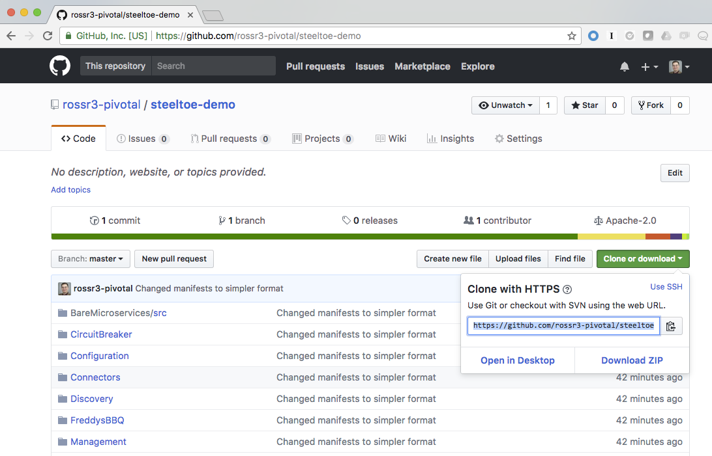
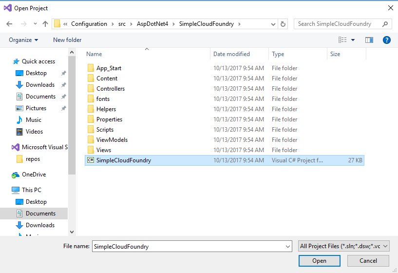
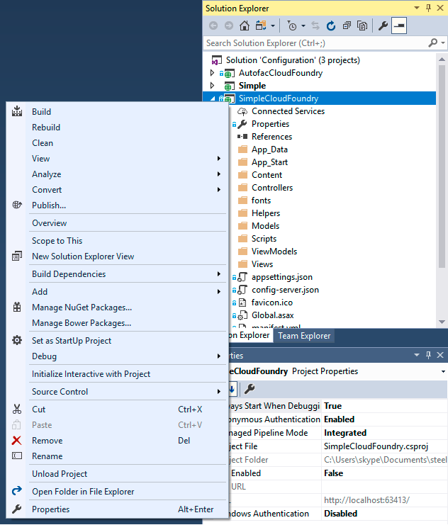
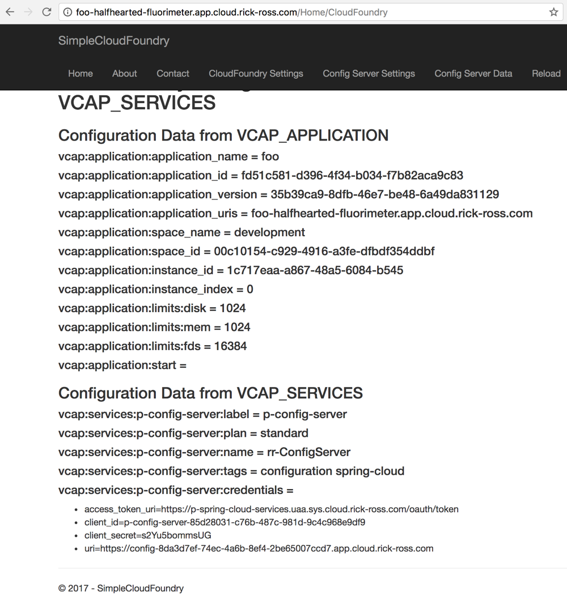
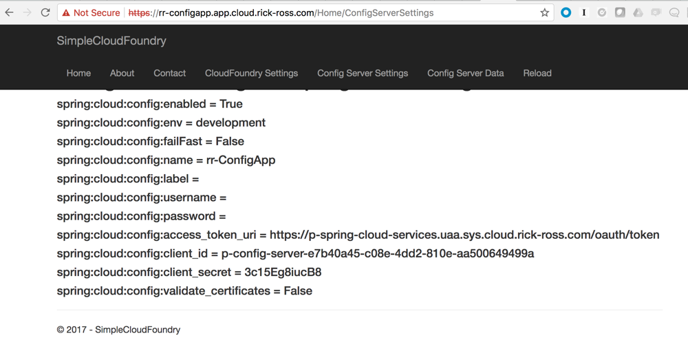
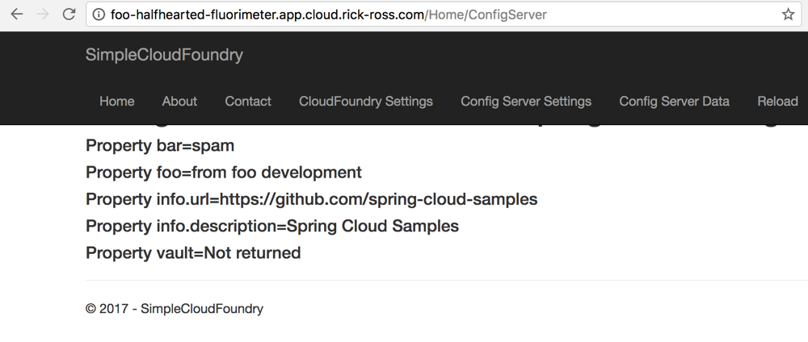

### Goal

Demonstrate how to use Steeltoe's Config Server with .NET Core applications.   


Prerequisites
--

1. Install Visual Studio 2017 Community Edition

    [Visual Studio 2017 Community](https://www.visualstudio.com/downloads/)

2. Clone the Steeltoe Demo

	[Steeltoe Demo:  https://github.com/rossr3-pivotal/steeltoe-demo](https://github.com/rossr3-pivotal/steeltoe-demo)
	
	##### Get the source code for the demo

   

	```
	C:\<Some Directory to save code>\> git clone https://github.com/rossr3-pivotal/steeltoe-demo.git
	```
	
Steps
--

In this demo we are going to follow these steps to deploy a .NET Framework application that communicates to the Configuration Server to retrieve its configuration.

***
## Deploying the Configuration Demo Application

### Step 1
##### Build and Publish the Configuration Demo Application

By this point, you should have cloned the [Steeltoe Demo:  https://github.com/rossr3-pivotal/steeltoe-demo](https://github.com/rossr3-pivotal/steeltoe-demo).  Let's prepare the application to deploy to Cloud Foundry. 

Open Visual Studio 2017, and navigate to the correct folder which is  Configuration/src/AspDotNet4/SimpleCloudFoundry Notice that we are going down several levels to the SimpleCloudFoundry Folder.

   

Right click on the SimpleCloudFoundry project in the solution explorer and select Publish.

   
   
Choose the Folder option, choose a folder and click Publish.

   
   
We'll use the folder in the next step.

### Step 2
##### Navigate to the Publish Folder 

Open up a Command Prompt or Powershell and navigate to the location of the published folder from the previous step

```
cd Configuration\src\AspDotNet4\SimpleCloudFoundry\bin\Release\PublishOutput
```
  
### Step 3
##### Login into Pivotal Cloud Foundry (if necessary)

  cf login -a https://api.sys.cloud.rick-ross.com --skip-ssl-validation
  Email: myuserid
  Password: ••••••••

  Select a space (or press enter to skip):
  1. development
  2. test
  3. production

  Select any one and stick to that space for the rest of the demo.

Login to the App Console at https://app.cloud.rick-ross.com

    

### Step 4
##### Create a Config Server within Pivotal Cloud Foundry

Let's create a config server that the application will use to get configuration information from:

```
cf create-service p-config-server standard MyConfigServer -c ./config-server.json
```

Note that this step might take a bit to complete. Please wait until you see that the last operation resulted is "create succeeded". To do that:

```bash
cf services
Getting services in org pivotal / space development as admin...
OK
    
name              service           plan       bound apps   last operation
MyConfigServer   p-config-server   standard                create in progress
```
    
Once this is successful, you will see this:

```bash
cf services
Getting services in org pivotal / space development as admin...
OK
    
name              service           plan       bound apps   last operation
MyConfigServer   p-config-server   standard                create succeeded
```

You can now proced to the next step. 
    

### Step 5
##### Push the app

Push the SimpleCloudFoundry application

```bash
cf push
```

Which will result in output of

```bash
// This will give an output which is similar to this
requested state: started
instances: 1/1
usage: 1G x 1 instances
urls: foo.app.cloud.rick-ross.com
last uploaded: Fri Oct 13 14:23:53 UTC 2017
stack: windows2012R2
buildpack: hwc 2.3.8
```

### Step 6
##### View the application in a Browser

Navigate the URL of the application in a browser. Then click on the CloudFoundry Settings menu / tab to view information from VCAP_APPLICATION and VCAP_SERVICES that are associated with this application running in Cloud Foundry. 

Here is the type of detail you see for the CloudFoundry Settings. Notice that you can see the instance ID and other information about this aplication.

   
   

Here is the type of detail you see for the Config Server Settings.  

   

And these are the details, or the data retrieved from the Config Server repository. 

   

To see what values it is pulling from files in the git repository, open a browser and navigate to the backing repo which is located here: [https://github.com/rossr3-pivotal/config-repo](https://github.com/rossr3-pivotal/config-repo). Look for properties files that have "foo" in their name. 

For additional information on Steeltoe Configuration please see the official documentation.  [http://steeltoe.io/docs/steeltoe-configuration/](http://steeltoe.io/docs/steeltoe-configuration/)

