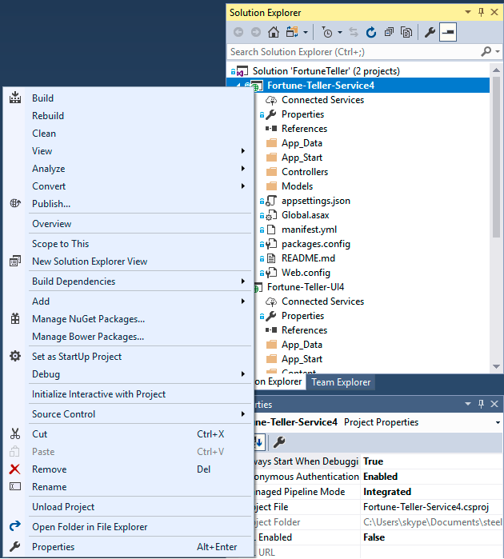
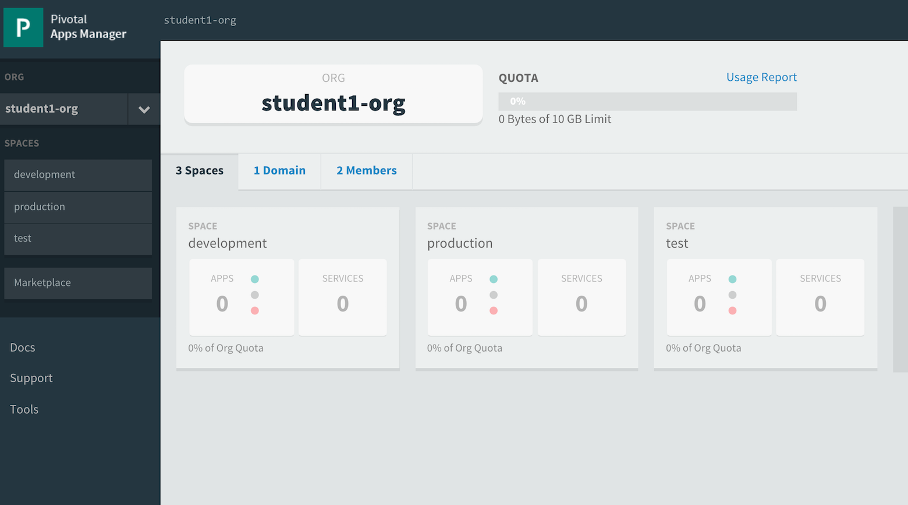
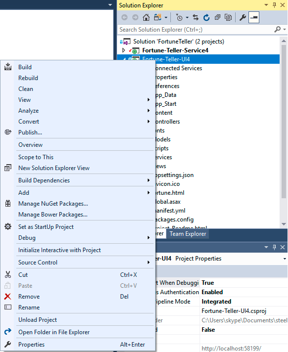
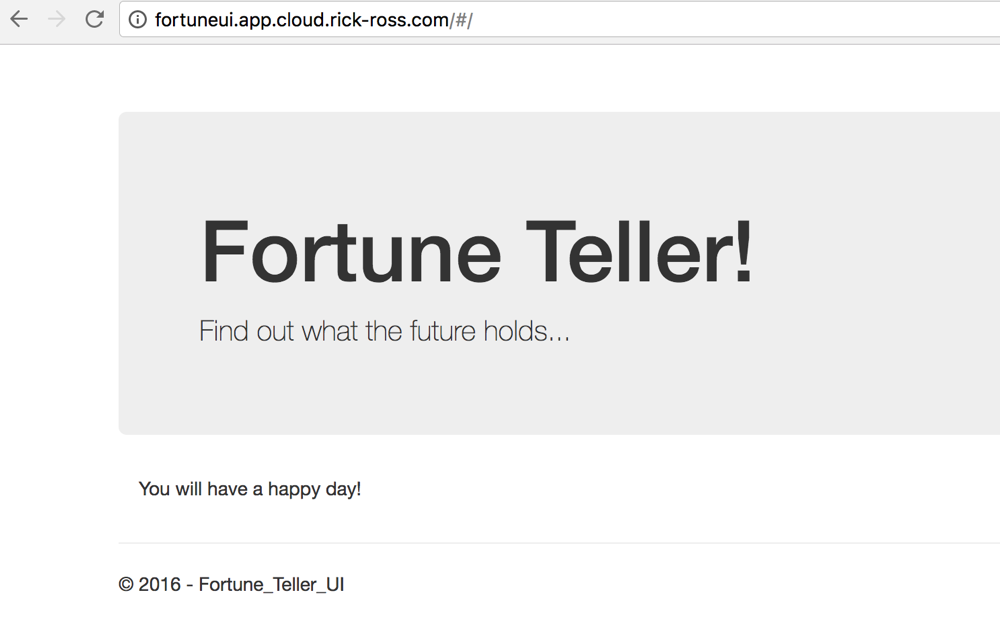
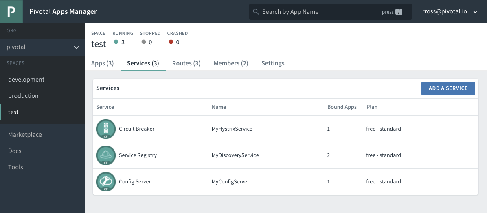
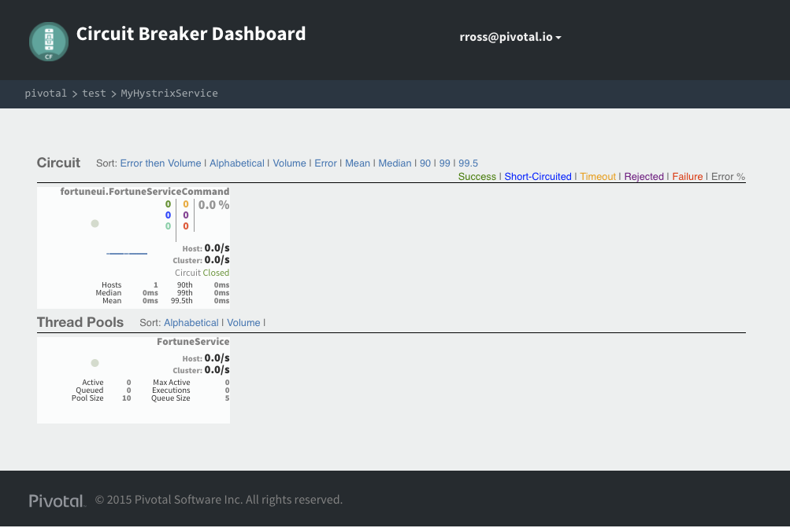

### Goal

Demonstrate how to use Steeltoe's Discovery and Circuit Breaker capabilities in a .NET Framework application to retrieve configuration infomration from Spring Cloud Discovery and Circuit Breaker services. 

Prerequisites
--

1. Install Visual Studio 2017 Community Edition

    [Visual Studio 2017 Community](https://www.visualstudio.com/downloads/)

2. Clone the Steeltoe Demo

	[Steeltoe Demo:  https://github.com/rossr3-pivotal/steeltoe-demo](https://github.com/rossr3-pivotal/steeltoe-demo)

	##### Get the source code for the demo app

   

	```
	C:\<Some Directory to save code>\> git clone https://github.com/rossr3-pivotal/steeltoe-demo.git
	```
	
Steps
--

In this demmo we are going to follow these steps to deploy a couple of .NET Framework applications that use the Service Discovery and the Circuit Breaker Dashboard to view the health of the microservices. 

***
## Deploying the Fortune Teller Service

### Step 1
##### Build and Publish the Fortune Teller Service

By this point, you should have cloned the [Steeltoe Demo:  https://github.com/rossr3-pivotal/steeltoe-demo](https://github.com/rossr3-pivotal/steeltoe-demo).  Let's prepare the application to deploy to Cloud Foundry. 

Open Visual Studio 2017 and open the FortuneTeller solution. It is located in the CircuitBreaker/src/AspDotNet4/FortuneTeller folder.  

   

Right click on the FortuneTeller-Service4 project in the solution explorer and select Publish

   
   
Choose the Folder option, choose a folder and click Publish

   
   
We'll use the folder in the next step.

### Step 2
##### Navigate to the Publish Folder 

Open up a Command Prompt or Powershell and navigate to the location of the published folder from the previous step

```
cd CircuitBreaker\src\AspDotNet4\FortuneTeller\Fortune-Teller-Service4\bin\Release\PublishOutput
```

### Step 3
##### Login into Pivotal Cloud Foundry (if necessary)

```
cf login -a https://api.sys.cloud.rick-ross.com --skip-ssl-validation
Email: myuserid
Password: ••••••••

Select a space (or press enter to skip):
1. development
2. test
3. production

Select any one and stick to that space for the rest of the workshop.
```

Login to the App Console at https://app.cloud.rick-ross.com

   

### Step 4
##### Create a Discovery Service within Pivotal Cloud Foundry

Let's create a discovery service that the application will use to get configuration information from:

```
cf create-service p-service-registry standard MyDiscoveryService
```

Note that this step might take a bit to complete. Please wait until you see that the last operation resulted is "create succeeded". To do that:

```bash
cf services
Getting services in org pivotal / space development as admin...
OK
    
name                  service              plan       bound apps   last operation
MyDiscoveryService   p-service-registry   standard                create in progress
```
    
Once this is successful, you will see this:

```bash
cf services
Getting services in org pivotal / space development as admin...
OK
    
name                  service              plan       bound apps   last operation
MyDiscoveryService   p-service-registry   standard                create succeeded
```

You can now proced to the next step. 
    
### Step 5
##### Push the app

Push the Fortune Service 

```bash
cf push 
```

Which will result in output of

```bash
// This will give an output which is similar to this
requested state: started
instances: 1/1
usage: 512M x 1 instances
urls: fortuneservice.app.cloud.rick-ross.com
last uploaded: Fri Oct 13 15:07:47 UTC 2017
stack: windows2012R2
buildpack: hwc 2.3.8
```

### Step 6
##### View the Fortune Service in a Browser

Open up the fortune app in a browser, appending api/fortunes to the end of the URL reported by Cloud Foundry. In the example above, it would be http://fortuneservice.app.cloud.rick-ross.com/api/fortunes


## Deploying the Fortune Teller UI Application

### Step 1
##### Build the Fortune Teller UI Application

By this point, you should have cloned the [Steeltoe Demo:  https://github.com/rossr3-pivotal/steeltoe-demo](https://github.com/rossr3-pivotal/steeltoe-demo).  Let's prepare the application to deploy to Cloud Foundry. 

Open Visual Studio 2017 and open the Fortune Teller  solution. It is located in the CircuitBreaker/src/AspDotNet4/FortuneTeller folder.  

   

Right click on the Fortune-Teller-UI4 project in the solution explorer and select Publish

   
   
Choose the Folder option, choose a folder and click Publish

   
   
We'll use the folder in a subsequent step.

### Step 2
##### Create a Circuit Breaker Dashboard Service within Pivotal Cloud Foundry

Let's create a Circuit Breakder Dashboard for the application:

```
cf create-service p-circuit-breaker-dashboard standard MyHystrixService
```

Note that this step might take a bit to complete. Please wait until you see that the last operation resulted is "create succeeded". To do that:

```bash
cf services
Getting services in org pivotal / space development as admin...
OK
    
name                  service                       plan       bound apps       last operation
MyDiscoveryService   p-service-registry            standard   fortuneService   create succeeded
MyHystrixService     p-circuit-breaker-dashboard   standard                    create in progress
```
    
Once this is successful, you will see this:

```bash
cf services
Getting services in org pivotal / space development as admin...
OK
    
name                  service                       plan       bound apps       last operation
MyDiscoveryService   p-service-registry            standard   fortuneService   create succeeded
MyHystrixService     p-circuit-breaker-dashboard   standard                    create succeeded
```

You can now proced to the next step. 
    
### Step 4
##### Navigate to the Publish Folder 

Open up a Command Prompt or Powershell and navigate to the location of the published folder from the previous step

```
cd CircuitBreaker\src\AspDotNet4\FortuneTeller\Fortune-Teller-UI4\bin\Release\PublishOutput
```

### Step 5
##### Push the app

Push the Fortune Teller UI

```bash
cf push 
```

Which will result in output of

```
// This will give an output which is similar to this
requested state: started
instances: 1/1
usage: 512M x 1 instances
urls: fortuneui.app.cloud.rick-ross.com
last uploaded: Fri Oct 13 15:30:59 UTC 2017
stack: windows2012R2
buildpack: hwc 2.3.8
```

Note: Restart both apps if it doesn't appear to be working

### Step 6
##### Visit the Fortune UI application in a Browser

Open the application URL in a browser. You will see something similar to this:

  

You can also tack on multiple at the end of the URL to have it return three Fortunes at once. In my case the full url would be this: [https://fortuneui.app.cloud.rick-ross.com/#/multiple](https://fortuneui.app.cloud.rick-ross.com/#/multiple)

### Step 8
##### Interact with the Hystrix Dashboard in Pivotal Cloud Foundry

Navigate to your apps manager, navigate to your org and space where your Fortune UI application is running. Click on the Services tab to see the services running:

  

Click on the Circuit Breaker service and then the Manage link in the upper right. If you are prompted to log in, do so. 

  

The dashboard gives you insights into what is going on with the microservices that your application is calling. Go back to the Fortune UI application in the browser and hit it several times using the multiple option. We want to get the traffic up to be able to see additional details in the dashboard.

  

Notice how you can see how many Hosts (Application Instances), the mean and median times and whether the circuit is closed (healthy) or not. Try going back and forth several times to see what times you are getting with your services.

For additional information on Steeltoe Service Discovery please see the official documentation.  
[http://steeltoe.io/docs/steeltoe-discovery/](http://steeltoe.io/docs/steeltoe-discovery/)

For additional information on Steeltoe Circuit Breaker, please see the official documentation.
[http://steeltoe.io/docs/steeltoe-circuitbreaker/](http://steeltoe.io/docs/steeltoe-circuitbreaker/)


